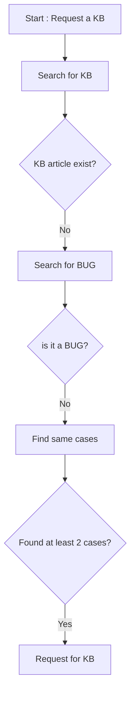

# KB Projet

## Presentation
This projet will help to implement a Knowledge base article request, identification, creation and validation.

In a customer care support context and point of view, a Knowledge base can play an important role to help the customer to solve his technical issues by himself or help the team to provide with proper technical solutions.

However due to this list of aspects, it is challenging to provide a solid KB source without spending to much time on it : 
- Constant evolution of the application/service you are supporting.
- Specific infrastructure or server configuration of the customer.
- Different actors that need to request, identify, create and valide a KB article.


In this project, we are putting ourself in place of a customer care engineer, but will need the help of leadtech customer care, technical success manager and developpers.

Any information in these data sources can be used to create a KB:

1)Zendesk solved cases:

Old solved cases from our current current ticketing system is an important source of data.
As customer care engineer we try to provide simple steps procedure to help the customer issues.
It is very common to solve a new case with what already exist in zendesk old cases.

**advices :**
It is a good practive to add a summary of the case (description, diagnostics, solution), to help others engineers to understand the case without having to read all the exchanges.

2)Slack channels:
The data source can be used to ask general questions to get confirmation of a functionnality, or start a topic about a potential bug detection.
We have channels for every functionnalities to be able to get in touch with the proper developpers.
However, we currently use the free version of Slack, preventing us to access to more than 90 days of chat history. [source](https://slack.com/intl/fr-fr/help/articles/115002422943-Limites-d%E2%80%99utilisation-des-espaces-de-travail-gratuits) 
But with the help of this Zendesk 

3)Confluence and Jira:

4)External sources (google, official documentation, Stackoverflow)


## KB Template/example : 
---
###### Begin of template

- [Informations](###Informations)
- [Symptoms](###Symptoms)
- [Verifications](###Verifications)
- [Identification](###Identification)
- [Solutions](###Solutions)

### Informations
Includes informations about the concerned OS, platform, packages or extensions versions.

ie: 
|         |      |      
| ------------- |:-------------:                |
| OS            | Debian 11 only                |
| platform      | Central with deported DB      |
| Extension     | Autodiscovery                 |
| Version       | 22.10                         |
| Package       | centreon-auto-discovery-server-22.10.4                         |

### Symptoms
Includes a short description or a list of symptoms of the issue behavior, with screenshots if possible.


ie:

Host discovery will not execute when clicking on "force execution button".
- popup with error message.
- on webbrowser dev tools : error 500 autodiscovery endpoint.

### Verifications
Includes a list of configuration, service, release notes or documentations link verifications, with screenshot if possible.

ie:

- Please make sure that autodiscovery job is properly with this link : https://docs.centreon.com/docs/22.10/monitoring/discovery/hosts-discovery/#job-discovery-wizard
- Verify that gorgoned service is active on your Central server with this command : 
```
hostname; systemctl status gorgoned -l
```

### Identification
Includes a list of logs files, sql requests result that will confirm it is the concerned issue.

ie :

1. Check for error in the logs file gorgoned.log :
```
grep "ERROR - \[autodiscovery\]"  /var/log/centreon-gorgone/gorgoned.log
```
expected result :
```
2024-01-17 14:16:55 - ERROR - [autodiscovery] -class- host discovery - cannot get host discovery jobs - request error [code: '500']
```

2. Check that the user and password are correct in the /etc/centreon-gorgone/config.d/31-centreon-api.yaml file.

### Solutions
Includes the list of actions required to solve this issue, with screenshot if possible. 

ie : 
1. Connect with local admin.
2. Go to the page (Administration > Extensions > Manager).
3. Reinstall the extension "Auto Discovery" :warning: do not remove the extension.
4. Go to the page (Configuration > Hosts > Discovery).
5. Select the job and click on "force execution".

If the workdaround is not working, please gather theses informations and request a support case on the Guard : https://support.centreon.com

###### End of template
---

## Diagram of the request KB process



## Diagram of the identification and creation KB process

```mermaid
flowchart TD
```

## Diagram of the validation KB process

```mermaid
flowchart TD
```

## Implementation

Google form + Form Approvals ? https://workspace.google.com/marketplace/app/form_approvals/835043066020
Zendesk checkbox + google execel sheet ? 
Zendesk form + approval workflow ? https://support.zendesk.com/hc/en-us/articles/4408832737818-Workflow-recipe-Creating-an-approval-process-between-departments

## More 

For somes of the created KB articles, in case of the verification part consist only of sql request or linux commands, this script https://github.com/alexvea/diag can be helpfull to diagnose then provide directly the customer for a KB article link.
