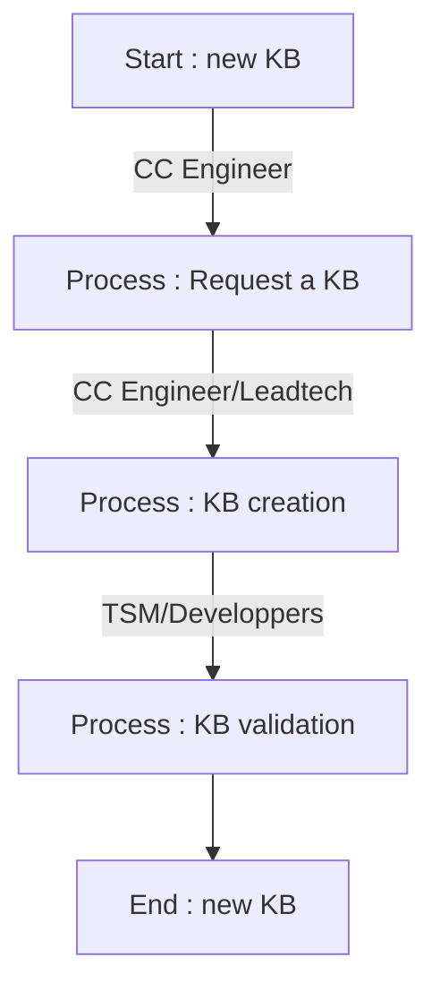

# KB Projet

## Summary :
1)[Presentation](##Presentation)

2)[Datasources](##Datasources)

3)[KB Template/example](##KBTemplate/example)

4)[Diagrams](##Diagrams)

5)[Implementation](##Implementation)

6)[More](##More)


## Presentation :
This projet will help to implement a Knowledge base article request, identification, creation and validation.

In a customer care support context and point of view, a Knowledge base can play an important role to help the customer to solve his technical issues by himself or help the team to provide with proper technical solutions.

However due to this list of aspects, it is challenging to provide a solid KB source without spending to much time on it : 
- Constant evolution of the application/service you are supporting.
- Specific infrastructure or server configuration of the customer.
- Different actors that need to request, identify, create and valide a KB article.


In this project, we are putting ourself in place of a customer care engineer, but will need the help of leadtech customer care, technical success manager and developpers.

## Datasources : 
Any information in these data sources can be used to create a KB:

1)Zendesk solved cases:

Old solved cases from our current ticketing system is an important source of data.
As customer care engineer we try to provide simple steps procedure to help the customer issues.
It is very common to solve a new case with what already exist in zendesk old cases.

**advices :**
It is a good practice to add a summary of the case (description, diagnostic, solution) at the end of the solved case, to help others engineers to understand the case without having to read all the exchanges.

2)Slack channels:

The data source can be used to ask general questions to get confirmation of a functionnality, or start a topic about a potential bug detection.
We have channels for every functionnalities to be able to get in touch with the proper experts/developpers.

However, we currently use the free version of Slack, preventing us to access to more than 90 days of chat history. [source](https://slack.com/intl/fr-fr/help/articles/115002422943-Limites-d%E2%80%99utilisation-des-espaces-de-travail-gratuits) 
But with the help of this Zendesk [app](https://www.zendesk.com/marketplace/apps/support/972305/slack/), we are able to keep the chat history in Zendesk side conversation functionnality.

**advices :**
After asking any questions, it's always a good practice to give a feedback if the answer/solution was helpfull.

3)Confluence and Jira:

Theses tools are mostly used for internal purpose by R&D and the CC Team.
In our Confluence [link](https://centreon.atlassian.net/wiki/spaces/PSD/pages/83690927/Customer+Care), we can find usefull informations like tools, processes or technical documentation. Actually as CC engineer, we can create topics to share some tips and tricks. We can call them <em>internal KB articles</em>.

In Jira, it includes BUG reports, QA processes, etc. In some of the BUG reports, it can contain <em>workaround fix/solution</em> provided by the CC engineers, the TSM or the developpers.

4)The Guard :

The website is the Customer care platform used by our supported customers to create new case. And it also includes KB articles mostly wrote by Leadtech, developpers or product owners. It is an important data source if supplied to avoid the customer to create new cases. We can call them <em>public KB articles</em>.

5)External sources (google, official documentation, Stackoverflow) :

As a CC engineer, it's not rare that we use external documentation to help to solve a customer case. We always try our best to provide a reliable informations.
We can call them <em>external KB articles</em>.


## KB Template/example : 
---
###### Begin of template

- [Informations](###Informations)
- [Symptoms](###Symptoms)
- [Verifications](###Verifications)
- [Identification](###Identification)
- [Solutions](###Solutions)

### Informations
Includes informations about the concerned OS, platform, packages or extensions versions.

ie: 
|         |      |      
| ------------- |:-------------:                |
| OS            | Debian 11 only                |
| platform      | Central with deported DB      |
| Extension     | Autodiscovery                 |
| Version       | 22.10                         |
| Package       | centreon-auto-discovery-server-22.10.4                         |

### Symptoms
Includes a short description or a list of symptoms of the issue behavior, with screenshots if possible.

ie :


Host discovery will not execute when clicking on "force execution button".
- popup with error message.
- on webbrowser dev tools : error 500 autodiscovery endpoint.

### Verifications
Includes a list of configuration, service, release notes or documentations link verifications, with screenshot if possible.

ie:

- Please make sure that autodiscovery job is properly with this link : https://docs.centreon.com/docs/22.10/monitoring/discovery/hosts-discovery/#job-discovery-wizard
- Verify that gorgoned service is active on your Central server with this command : 
```
hostname; systemctl status gorgoned -l
```

### Identification
Includes a list of logs files, sql requests result that will confirm it is the concerned issue.

ie :

1. Check for error in the logs file gorgoned.log :
```
grep "ERROR - \[autodiscovery\]"  /var/log/centreon-gorgone/gorgoned.log
```
expected result :
```
2024-01-17 14:16:55 - ERROR - [autodiscovery] -class- host discovery - cannot get host discovery jobs - request error [code: '500']
```

2. Check that the user and password are correct in the /etc/centreon-gorgone/config.d/31-centreon-api.yaml file.

### Solutions
Includes the list of actions required to solve this issue, with screenshot if possible. 

ie : 
1. Connect with local admin.
2. Go to the page (Administration > Extensions > Manager).
3. Reinstall the extension "Auto Discovery" :warning: do not remove the extension.
4. Go to the page (Configuration > Hosts > Discovery).
5. Select the job and click on "force execution".

If the workaround is not working, please gather theses informations and request a support case on the Guard : https://support.centreon.com

###### End of template
---

## Diagrams :

### Global diagram : 



<table>
  <tr>
    <td>Diagram of the request KB process : <pre lang="mermaid"><code>flowchart TD
A[Start : Request a KB] --> B[Search for KB];
B[Search for KB] --> C{KB article exist?};
C -- No --> D[Search for BUG];
D[Search for BUG] --> E{is it a BUG?};
E -- No --> F[Find same cases];
F[Find same cases] --> G{Found at least 2 cases?};
G -- Yes --> H[Fill the Form];
H[Fill the Form] --> I[End : Request for KB];
    </code></pre></td>
    <td>Diagram of the identification and creation KB process<pre lang="mermaid"><code>flowchart TD
A[Start : KB creation] --> B[Identify KB type];
B[Identify KB type] --> C[Use KB template];
C[Use KB template] --> D[Identify platform informations];
D[Identify platform informations] --> E[Identify Symptons];
E[Identify Symptons] --> F[Identify Verification];
F[Identify Verifications] --> G[Identify Identifications];
G[Identify Identifications] --> H[Identify Solutions];
H[Identify Solutions] --> I[identify Solutions];      
I[Save KB article in form] --> J[End : KB creation];
    </code></td>
    <td>Diagram of the validation KB process<pre lang="mermaid"><code>flowchart TD
A[Start : KB validation] --> B[Read saved KB article in form];
B[Read saved KB article in form] --> C[Verify KB article];
C[Verify KB article] --> D{Is it correct?};
D -- Yes --> E{Is it a new BUG?};
D -- No --> F[Modify KB article];
F --> E{Is it a new BUG?}
E -- Yes --> G[Create a JIRA];
E -- No --> H[Identify KB type];
G --> H[Identify KB type];
H[Identify KB type] --> I[Publish KB article];
I[Publish KB article] --> J[End : KB validation];
    </code></td>
  </tr>
</table>


## Implementation :

TODO

Google form + Form Approvals ? https://workspace.google.com/marketplace/app/form_approvals/835043066020

Zendesk checkbox + google excel sheet ? 

Zendesk form + approval workflow ? https://support.zendesk.com/hc/en-us/articles/4408832737818-Workflow-recipe-Creating-an-approval-process-between-departments

## More :

For somes of the created KB articles, in case of the verification part consist only of sql request or linux commands, this script https://github.com/alexvea/diag can be helpfull to diagnose then provide directly the customer for a KB article link.

## TODO :
"chapitre dans KB dont certains non visible par le client"
maintien des KBs (via les versions)
