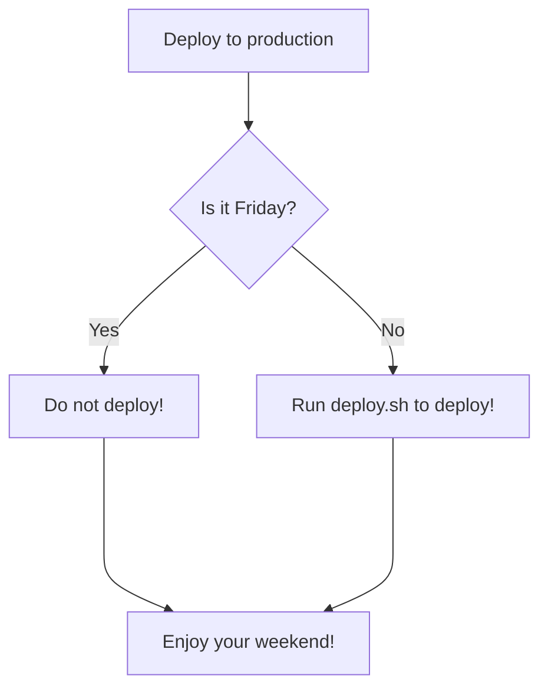

# KB Projet

## Presentation
This projet will help to implement a Knowledge base article request, identification, creation and validation.

In a customer care support context and point of view, a Knowledge base can play an important role to help the customer to solve his technical issues by himself or help the team to provide with proper technical solutions.

However due to this list of aspects, it is challenging to provide a solid KB source without spending to much time on it : 
- Constant evolution of the application/service you are supporting.
- Specific infrastructure or server configuration of the customer.
- Different actors that need to request, identify, create and valide a KB article.

In this project, we are putting ourself in place of a customer care engineer, but will need the help of leadtech customer care, technical success manager and developpers.

## KB Template : 

- [Symptoms](#####Symptoms)
- [Verifications](#####Verifications)
- [Identification](#####Identification)
- [Solutions](#####Solutions)

##### Symptoms

##### Verifications

##### Identification

##### Solutions

Diagram of the process

